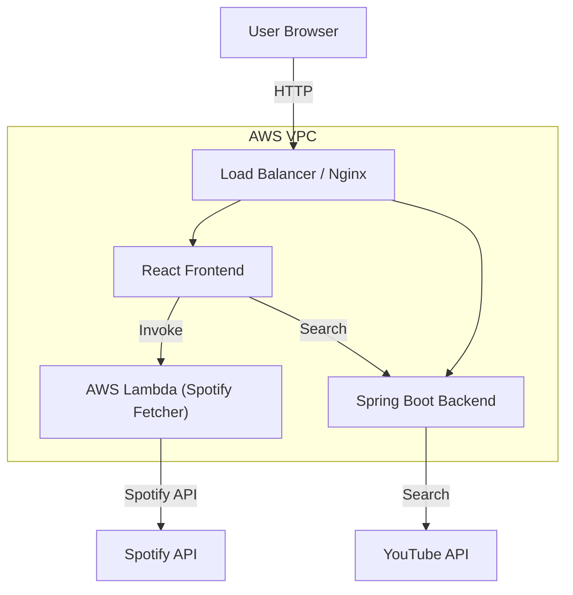

# Spotify to YouTube List Converter


An open-source cloud-native service to convert your Spotify playlists to YouTube Music lists. This project demonstrates a modern microservices architecture using Java Spring Boot, React, and serverless computing on AWS, fully orchestrated with Terraform and Kubernetes (K3s).

---

## 📖 Table of Contents
- [Architecture](#-architecture)
- [Features](#-features)
- [Tech Stack](#-tech-stack)
- [Prerequisites](#-prerequisites)
- [Getting Started](#-getting-started)
  - [Run Locally (Docker Compose)](#run-locally-docker-compose)
  - [Cloud Deployment (AWS & Terraform)](#cloud-deployment-aws--terraform)
- [Configuration](#-configuration)
- [Contributing](#-contributing)

---

## 🏗 Architecture

The application works by decoupling the Spotify data fetching from the main backend logic.



### Infrastructure Highlights
- **Compute**: K3s (Lightweight Kubernetes) cluster running on AWS EC2 (`t3.micro`).
- **Serverless**: AWS Lambda (Python 3.10) for fetching Spotify playlist data.
- **CI/CD**: GitHub Actions for automated building, tagging, and deployment.
- **Container Registry**: AWS ECR for storing secure Docker images.
- **IaC**: Entire infrastructure provisioned via **Terraform**.

---

## ✨ Features

- **Playlist Conversion**: Seamlessly transfer playlists from Spotify to YouTube.
- **Mock Mode**: Development mode to test without active Spotify API rate limits.
- **Search & Match**: Smart matching algorithm to find the best YouTube video for a track.
- **Responsive UI**: Modern Material UI design.
- **Cloud Native**: Designed for resilience and scalability.

---

## 🛠 Tech Stack

### Frontend
- **Framework**: React 19 (Vite 7)
- **UI Library**: Material UI (MUI) v6
- **State/HTTP**: Axios

### Backend
- **Framework**: Spring Boot 3.2 (Java 21)
- **Build Tool**: Maven

### Infrastructure & DevOps
- **Cloud Provider**: AWS
- **IaC**: Terraform
- **Orchestration**: Kubernetes (K3s)
- **Functions**: AWS Lambda (Python)
- **CI/CD**: GitHub Actions

---

## 📋 Prerequisites

Before you begin, ensure you have the following installed:

- **Docker & Docker Compose**: For local development.
- **AWS CLI**: configured with appropriate credentials (for deployment).
- **Terraform**: v1.0+ (for infrastructure).
- **kubectl**: (optional) to interact with the cluster.
- **Node.js 18+ & Java 21**: (if running without Docker).

---

## 🚀 Getting Started

### Run Locally (Docker Compose)

The easiest way to run the full stack locally is using Docker Compose.

1.  **Clone the repository**
    ```bash
    git clone https://github.com/barispolatt/Spotify-Youtube-List-Converter.git
    cd Spotify-Youtube-List-Converter
    ```

2.  **Configure Environment Variables**
    Create/Edit `.env` file (or set variables in `docker-compose.yml`):
    ```env
    SPOTIFY_CLIENT_ID=your_id
    SPOTIFY_CLIENT_SECRET=your_secret
    YOUTUBE_API_KEY=your_key
    ```

3.  **Start Services**
    ```bash
    docker-compose up --build
    ```
    
    - Frontend will be available at: `http://localhost:3000`
    - Backend will be available at: `http://localhost:8080`

### Cloud Deployment (AWS & Terraform)

To deploy the entire stack to AWS:

1.  **Navigate to Terraform Directory**
    ```bash
    cd terraform/enviroments/dev
    ```

2.  **Initialize Terraform**
    ```bash
    terraform init
    ```

3.  **Configure Credentials**
    Create a `terraform.tfvars` file in `terraform/enviroments/dev/` to securely set your Spotify API keys:
    ```hcl
    spotify_client_id     = "your_spotify_client_id"
    spotify_client_secret = "your_spotify_client_secret"
    ```

4.  **Review Plan**

    ```bash
    terraform plan
    ```

4.  **Apply Infrastructure**
    ```bash
    terraform apply
    ```
    *Note: This will provision EC2, VPC, ECR, and Lambda resources. Ensure you have permissions.*

---

## 🔧 Configuration

### Environment Variables

| Variable | Description | Required |
|:--- | :--- | :--- |
| `SPOTIFY_CLIENT_ID` | OAuth Client ID from Spotify Developer Dashboard | Yes |
| `SPOTIFY_CLIENT_SECRET`| OAuth Client Secret | Yes |
| `YOUTUBE_API_KEY` | API Key for YouTube Data API v3 | Yes |
| `SPRING_PROFILES_ACTIVE`| Spring Boot profile (e.g., `dev`, `prod`) | No (Local: default) |

---

## 🤝 Contributing

Contributions are welcome! Please follow these steps:

1. Fork the project.
2. Create your feature branch (`git checkout -b feature/AmazingFeature`).
3. Commit your changes (`git commit -m 'Add some AmazingFeature'`).
4. Push to the branch (`git push origin feature/AmazingFeature`).
5. Open a Pull Request.

---


